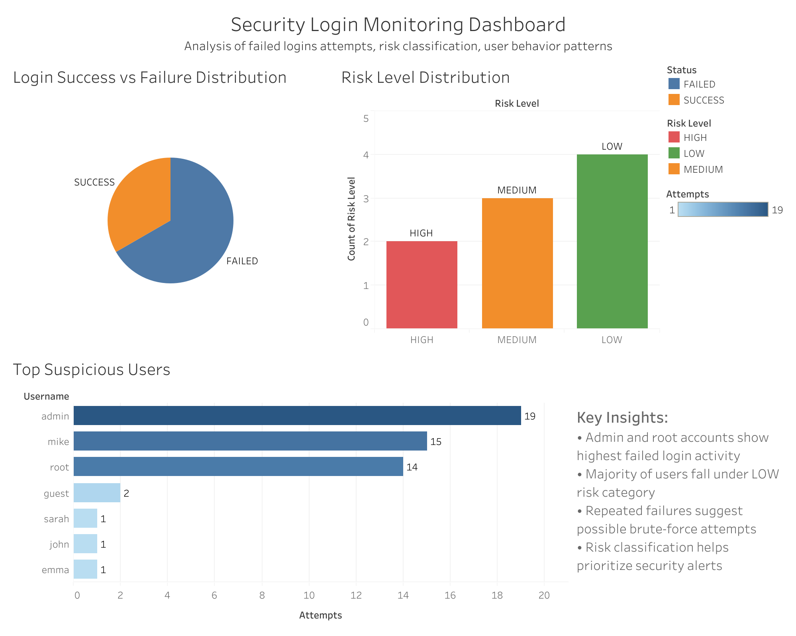

## Security Login Monitoring Dashboard

# Overview

This project analyzes login activity data to detect suspicious behavior, identify failed authentication patterns, and classify users based on security risk levels.

The goal is to simulate a SOC (Security Operations Center) style investigation dashboard using structured data analysis and visualization.

The dashboard was built using Tableau Public.

⸻

# Objectives

	•	Identify failed vs successful login activity
	•	Detect users with repeated failed login attempts
	•	Classify users into risk categories (LOW, MEDIUM, HIGH)
	•	Visualize security patterns for quick interpretation
	•	Build a portfolio-ready security analytics dashboard

⸻

# Tools & Technologies

	•	Tableau Public (Data Visualization)
	•	CSV (Dataset storage)
	•	SQL logic (conceptual analysis: GROUP BY, CASE WHEN, HAVING)
	•	Data analysis concepts (aggregation, anomaly detection, risk scoring)

____

# Dashboard Features

1. Login Success vs Failure Distribution (Pie Chart)

	•	Shows proportion of failed vs successful login attempts
	•	Helps identify overall authentication health

2. Top Suspicious Users (Bar Chart)

	•	Highlights users with the highest number of login attempts
	•	Useful for identifying brute-force behavior

3. Risk Level Distribution

	•	Categorizes users into:
	•	LOW risk
	•	MEDIUM risk
	•	HIGH risk
	•	Based on frequency of failed login attempts

⸻

# Key Insights

	•	Admin and root accounts showed the highest number of failed login attempts, indicating potential targeted access attempts.
	•	Most users fall under the LOW risk category, suggesting normal system behavior for the majority of activity.
	•	A small group of users exhibits repeated failed login attempts, which may indicate brute-force or password-guessing behavior.
	•	Risk classification helps prioritize security alerts and monitoring efforts.

____

# Dashboard Preview

____

# Author Note

This project is part of a self-built learning roadmap combining:

	•	Python programming
	•	SQL analytics
	•	Statistics fundamentals
	•	Security analytics concepts
	•	Data visualization

It represents a foundational step toward a career in data analytics and cybersecurity (SOC analysis).

